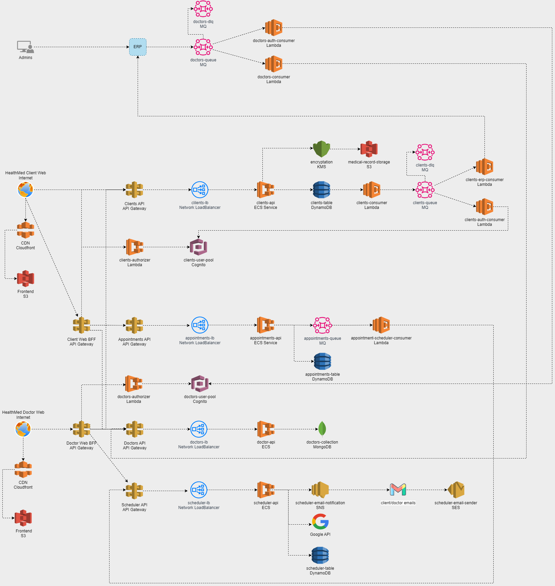

# Hackathon Pós Tech FIAP - 4SOAT


## Descrição do sistema

A HealthMed está desenvolvendo um sistema robusto, escalável e seguro para o gerenciamento eficiente de agendamentos e consultas online. Ele integra funcionalidades como autenticação segura de médicos e pacientes, agendamento e gerenciamento de consultas, realização de teleconsultas via integração com a API do Google, e um prontuário eletrônico robusto para armazenamento e compartilhamento de registros médicos. Este documento descreve a arquitetura detalhada do sistema, dividida em vários componentes e serviços.

## Arquitetura
É expressamente recomendado a visualização da arquitetura no Draw.io, além de uma maior nitidez para a visualização dos componentes da arquitetura, também é possível visualizar o fluxo dos dados.  
Link: [Arquitetura-draw.io](https://drive.google.com/file/d/1SjWMS8WzQ69KsnlqjmbpEx1lQzzLqOW_/view?usp=sharing)   
A arquitetura do sistema HealthMed foi planejada de maneira que haja três diferentes modos de acesso ou entrada de dados.  O primeiro modo de acesso é através de um ERP, no qual será acessado por um administrador e será responsável por todo cadastro pessoal e gerenciamento financeiro da HealthMed. O segundo modo de acesso será através do nosso portal para clientes, onde eles poderão fazer seu cadastro através de uma rota pública, as credenciais de acesso,  autenticar no nosso sistema e realizar o agendamento de consultas. O último modo de acesso será uma plataforma exclusiva para os médicos, onde eles poderão fazer o acompanhamento de suas consultas, além da confirmação dos agendamentos.




## Tecnologias e Serviços Utilizados

**ERP:** Sistema centralizado que gerencia e integra as principais funções administrativas e operacionais da empresa.  

**Amazon MQ:** Uma fila de mensagens do RabbitMQ que desacopla os componentes do sistema, permitindo maior flexibilidade e escalabilidade. Garante que as mensagens sejam processadas de maneira ordenada e resiliente, mesmo em caso de picos de demanda ou falhas temporárias.    

**Amazon MQ (DLQ):** A DLQ é crucial para gerenciar e solucionar problemas de mensagens com falhas, sem impactar o fluxo normal de processamento. O Amazon MQ oferece suporte robusto para DLQs, garantindo que as mensagens sejam devidamente tratadas. Isso evita a perda de dados e permite uma melhor gestão de erros.  

**AWS Lambda:** É um serviço de computação sem servidor que executa código em resposta a eventos e gerencia automaticamente os recursos computacionais. Lambdas são ideais para processamento assíncrono de mensagens devido à sua escalabilidade automática e custo-eficiência, pois você paga apenas pelo tempo de execução do código. Elas permitem que o sistema responda rapidamente a variações na carga de trabalho sem a necessidade de provisionar infraestrutura dedicada e também reduz a complexidade operacional, pois não requer gerenciamento de servidores.  

**Amazon Cognito:** O Amazon Cognito é um serviço gerenciado que facilita a adição de controle de usuário e autenticação a suas aplicações web e móveis. Proporciona um gerenciamento completo de identidade e acesso, incluindo suporte a MFA (autenticação multifator), integração fácil com outras APIs AWS, escalabilidade automática e conformidade com normas de segurança. 

**Amazon S3 (Simple Storage Service):** É um serviço de armazenamento de objetos. Possui alta durabilidade, disponibilidade de dados e custo-benefício, permitindo armazenar grandes volumes de documentos e gerenciamento simples de versões e backups. 

**CloudFront CDN (Content Delivery Network):** Garante rápido carregamento de páginas para usuários, proporcionando entrega rápida e segura dos conteúdos do frontend, reduzindo a latência e melhorando a experiência do usuário final ao distribuir conteúdo a partir de servidores próximos aos usuários.  

**API Gateway:** O API Gateway é um serviço gerenciado que facilita a criação, publicação, manutenção, monitoramento e proteção de APIs em qualquer escala. Ele roteia as requisições para o serviço apropriado, aplica políticas de segurança, cache e throttling, melhorando a eficiência e a segurança do sistema. Ele facilita a escalabilidade e a manutenção, além de integrar-se facilmente com outros serviços AWS como o Cognito.  

**BFF (Backend for Frontend):** É um padrão de design que cria uma camada intermediária adaptada especificamente às necessidades do frontend, tornando a interface do usuário mais eficiente e responsiva. 

**ECS:** O ECS é um serviço de orquestração de contêineres que facilita a execução, escalabilidade e segurança de aplicações. 

**NLB:**  O NLB distribui o tráfego de rede de entrada entre os contêineres ECS, garantindo alta disponibilidade e escalabilidade.. Ele é projetado para lidar com milhões de requisições por segundo enquanto mantém latências ultra-baixas. Optamos pelo NLB ao invés do Application Load Balancer devido à sua resiliência, alta performance, baixa latência e capacidade de failover rápido, além de ser mais econômico em termos de custos operacionais devido à sua simplicidade e eficiência.  

**DynamoDB:** Um banco de dados NoSQL totalmente gerenciado, conhecido por sua baixa latência e escalabilidade automática. Oferece alta performance e escalabilidade automática, suportando operações de leitura e escrita de baixa latência, essenciais para um sistema em tempo real. Pode ser configurado em minutos com o mínimo de sobrecarga de infraestrutura.  

**KMS:** Um serviço gerenciado de criação e controle de chaves criptográficas para proteger dados. Oferece segurança robusta e conformidade com regulamentos de proteção de dados, além de integração fácil com outros serviços AWS para gerenciamento de chaves e criptografia de dados.   

**SNS:** O SNS é um serviço de mensagens totalmente gerenciado que facilita o envio de notificações para um grande número de destinatários.  

**SES:** É um serviço de envio de emails escalável e econômico que permite enviar emails em massa e transacionais.

**MongoDB:** Um banco de dados NoSQL orientado a documentos, conhecido por sua flexibilidade, escalabilidade e performance.  A estrutura de documentos do MongoDB permite armazenar dados complexos e aninhados de maneira eficiente.  

**Google API:** APIs fornecidas pelo Google que permitem integração com vários serviços, como Google Calendar e Google Meet. Fornece uma integração robusta e confiável com os serviços de calendário e videoconferência do Google, facilitando a organização e a condução de teleconsultas. É amplamente usada e aceita, garantindo uma experiência familiar e consistente para os usuários.

## Como executar o projeto

Pré-requisitos ⚙️

[](https://pkg.go.dev/golang.org/x/example)

### Preparação 

1. Clone esse projeto do repositório do Github
```bash
  git clone https://github.com/g73-fiap/hackaton-healthmed.git
```

2. Acesse a pasta do projeto pelo terminal/cmd
```bash
  cd hackaton-healthmed
```

3. Atualize as dependências Go
```bash
  go mod tidy
```


## Estrutura Geral do projeto

```bash
├── vscode
├── cmd
├── configs
├── docs
├── internal
|   |── api
|   |── controllers
|   ├── core
|   │   ├── entities
|   │   ├── usecases
|   ├── infra
|   │   ├── drivers
|   │   ├── gateways
```


## Postman Collection

[Hachathon-HealthMed-Postman](https://github.com/g73-fiap/hackaton-healthmed/blob/main/docs/hackathon-helthMed.postman_collection.json) 

## Swagger

[Hackathon-HealthMed-Swagger](https://github.com/g73-fiap/hackaton-healthmed/blob/main/docs/swagger_hackathon-helthMed.yml)